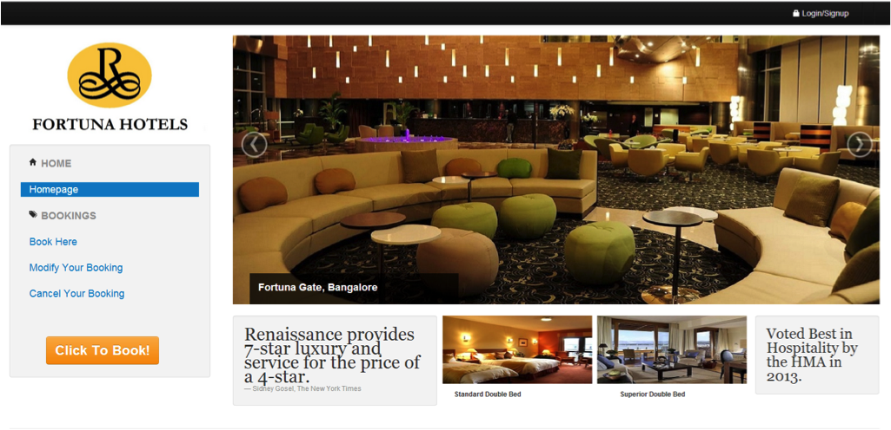

cs2102
======

This is a simple website developed as part of the cs2102 assignment - (Database Systems). 

The Fortuna Group of hotels is a fictitious Indian hotel chain that has just embarked on an online room booking project. Currently, the chain has a total of 6 branches spanning across 4 major cities in India namely Mumbai, Kolkata, Ahmedabad and Delhi. With this new system, a guest can book rooms and manage bookings with ease. The website allows the guest to search for hotels based on the features (swimming pool, gym, etc.) that they’d like and book rooms in the respective hotels. It also gives the user the facility to book rooms based on the city they would like to stay in. In addition, the user can manage previous bookings via this website. The admin of the website has the option to create, modify and delete bookings using the website.
